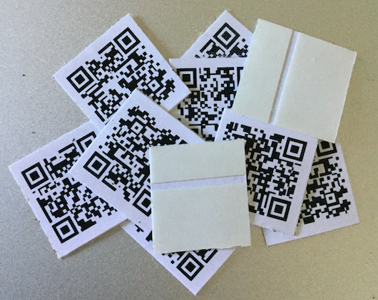
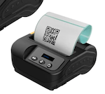

  

    <h2 style="color: #3a5169;">Magic Label™ is the <b>URL configurable</b> pre-printed QR code label sticker</h2>
    
    
<a href="./guide/how-it-works">How it works?</a>

    
Magic Label™ is a <b>Pre-printed QR code label sticker</b> you can stuck everywhere, and quite amazingly <b>you can set a URL</b> on it with your mobile.

    
The <b>first scan</b>, your mobile goes to the site for setting a URL.

    
<b>Subsequent scan</b> works to go to the URL you've set as an ordinary QR code.

    
Get hands-on experience with our <a href="https://ml.uedasoft.com/demo">demo site</a>.

  

  

    <h2 style="color: #3a5169;">No need to carry around a <a href="https://www.amazon.co.jp/s?k=label+printer">label printer</a> device.</h2>
    
No need to prepare any special hardware, nor install any special software. You can set a redirect URL with an ordinary QR code reader app on your mobile, like iOS default camera application. At the first time of reading the unused Magic Label™, you will be led to the page for URL registration. You can associate it with the URL which you register here. Once the URL is registered, it can be used same as a normal QR code. Reading this, you will be redirected to the registered URL.

    
  

  

    <h2 style="color: #3a5169;">Changing the registered redirect URL and referring to how many redirected</h2>
    
Not only one-time web address registration but also you can change their web address after registered as an owner of it at Magic Label™ site. The ability to freely change their Web address lets you so flexible usage like fixing wrong or deprecated URL, or change URL according to year, season or day. Also, Magic Label tells you how many times it was read, unlike a normal QR code. You can take advantage of this information for more effective use.

  

  

    <h2 style="color: #3a5169;">The sample product is abailable</h2>
    <a href="https://payhip.com/b/GPHU">go to the shop</a>
    
The sample product is available from the link above. Ordered items will be delivered by aerogram.

    
  

  

    <h2 style="color: #3a5169;">Buy Magic Label™ Now!</h2>
    <stripe-buy-button
      buy-button-id="buy_btn_1NRYCkG8LX1Yc059ZP3rsE7L"
      publishable-key="pk_live_5YsfTybJwax93Ph5rsr8qZDx"
    >
    </stripe-buy-button>
    <h2 style="color: #3a5169;"><a href="https://payhip.com/b/bj4t2">or go to Payhip</a></h2>
  

<!--  
  

    <h2 style="color: #3a5169;">Also, you can make your own Magic Label™</h2>
    <a href="https://magiclabel.uedasoft.com/">go to the site</a>
    
You can get a printable image of your Magic Label™ at the site so get it and print it that suits your purpose freely. Without buying pre-printed Magic Label™, you will get one Magic Label™ image at sign-in to the Magic Label™. Please enjoy with print it.

  

-->

## For example you can use for ...
- Fix outdated or wrong URL on the posters. Paste onto old QR code to cover with the Magic Label™ and set the correct URL on it.